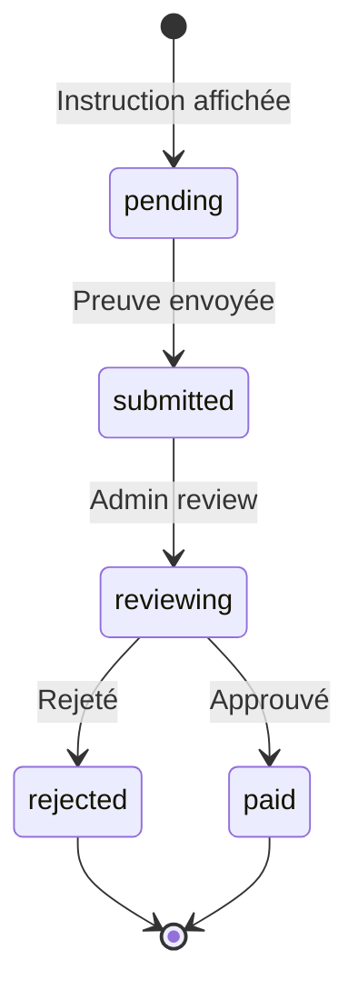

# Paiements manuels et fallback

## 1. Problématique

Certains PSP ne couvrent pas toutes les régions :
- **Stripe** : limité en Afrique subsaharienne
- **PayPal** : restrictions dans certains pays
- **Mobile Money** : pas de PSP unique couvrant tout

**Solution** : PSP principal + fallback manuel

## 2. Architecture

```
┌──────────────┐
│   Checkout   │
│              │
│  Détection   │──┐
│  du pays     │  │
└──────────────┘  │
                  │
        ┌─────────▼─────────┐
        │   Routeur PSP     │
        │                   │
        │  Pays supporté?   │
        │  Oui → PSP auto   │
        │  Non → Fallback   │
        └─────────┬─────────┘
                  │
    ┌─────────────▼─────────────┐
    │                           │
┌───▼────┐              ┌───────▼───────┐
│ PSP    │              │   Fallback    │
│ auto   │              │    manuel     │
│        │              │               │
│ Stripe │              │ Virement     │
│ Paystack│             │ Mobile Money │
│ PayPal │              │ Chèque       │
└────────┘              └───────────────┘
```

## 3. Workflow fallback manuel

### États



### Détails

| État | Description | Action utilisateur | Action admin |
|------|-------------|-------------------|--------------|
| pending | En attente de paiement | Effectuer le virement | — |
| submitted | Preuve envoyée | Upload reçu/relevé | Vérifier |
| reviewing | En cours de review | Attendre | Examiner |
| paid | Paiement confirmé | Notification | Confirmer |
| rejected | Paiement rejeté | Notification | Rejeter + motif |

## 4. Types de fallback

### Virement bancaire

```typescript
interface BankTransfer {
  type: 'bank_transfer';
  bankName: string;
  iban: string;
  bic: string;
  accountHolder: string;
  reference: string; // Code unique
  amount: number;
  currency: string;
  instructions: string;
}
```

### Mobile Money

```typescript
interface MobileMoney {
  type: 'mobile_money';
  provider: 'orange' | 'mtn' | 'airtel' | 'mpesa';
  phoneNumber: string;
  reference: string;
  amount: number;
  currency: string;
  instructions: string;
}
```

### Autres

```typescript
interface ManualPayment {
  type: 'check' | 'cash' | 'crypto';
  instructions: string;
  reference: string;
  amount: number;
  currency: string;
}
```

## 5. Validation manuelle

### Processus

```
1. Utilisateur effectue le paiement
2. Utilisateur upload la preuve (photo, PDF)
3. Système enregistre en pending_review
4. Admin reçoit une notification
5. Admin vérifie :
   - Montant correct
   - Référence correcte
   - Date récente
   - Pas de doublon
6. Admin approuve ou rejette
7. Système notifie l'utilisateur
```

### Séparation des devoirs

| Rôle | Action | Règle |
|------|--------|-------|
| Utilisateur | Initier paiement | Toujours |
| Utilisateur | Upload preuve | Si fallback |
| Manager | Review basique | Si seuil bas |
| Admin | Approuver | Si seuil haut |

### Seuils

```typescript
const REVIEW_THRESHOLDS = {
  auto_approve: 50,    // €
  manager_review: 500, // €
  admin_review: Infinity
};
```

## 6. Réconciliation

### Import de relevés

```typescript
interface ReconciliationEntry {
  date: Date;
  reference: string;
  amount: number;
  description: string;
  counterparty: string;
}
```

### Matching

```typescript
async function reconcile(entries: ReconciliationEntry[]) {
  const results = { matched: 0, unmatched: 0, errors: [] };

  for (const entry of entries) {
    // Chercher par référence
    const payment = await db.payment.findFirst({
      where: {
        reference: entry.reference,
        status: 'pending'
      }
    });

    if (!payment) {
      results.unmatched++;
      results.errors.push(`No match for ${entry.reference}`);
      continue;
    }

    // Vérifier le montant
    if (Math.abs(payment.amount - entry.amount) > 0.01) {
      results.errors.push(`Amount mismatch: ${payment.amount} vs ${entry.amount}`);
      continue;
    }

    // Marquer comme payé
    await db.payment.update({
      where: { id: payment.id },
      data: { status: 'paid', reconciledAt: new Date() }
    });

    results.matched++;
  }

  return results;
}
```

## 7. Anti-fraude

### Règles

| Règle | Description | Action |
|-------|-------------|--------|
| Velocity | > 3 paiements/heure | Bloquer |
| Montant | > seuil pays | Review |
| Doublon | Même référence | Rejeter |
| Blacklist | Email/IP/bénéficiaire | Bloquer |

### Détection

```typescript
async function checkFraudRules(payment: Payment) {
  // Velocity
  const recentCount = await db.payment.count({
    where: {
      tenantId: payment.tenantId,
      userId: payment.userId,
      createdAt: { gte: subHours(new Date(), 1) }
    }
  });
  if (recentCount > 3) return { blocked: true, reason: 'velocity' };

  // Blacklist
  const blacklisted = await db.blacklist.findFirst({
    where: { value: payment.email }
  });
  if (blacklisted) return { blocked: true, reason: 'blacklisted' };

  return { blocked: false };
}
```

## 8. Notifications

| Événement | Canal | Destinataire |
|-----------|-------|--------------|
| Paiement en attente | Email + In-app | Utilisateur |
| Preuve reçue | In-app | Admin/Manager |
| Paiement approuvé | Email + In-app | Utilisateur |
| Paiement rejeté | Email + In-app | Utilisateur |
| Nouveau virement | Email | Admin |

## 9. Checklist

- [ ] PSP principal configuré
- [ ] Fallback manuel documenté
- [ ] Workflow d'états défini
- [ ] Seuils de review configurés
- [ ] Séparation des devoirs implémentée
- [ ] Upload de preuve fonctionnel
- [ ] Processus de réconciliation
- [ ] Anti-fraude en place
- [ ] Notifications configurées
- [ ] Tests de flux complets
