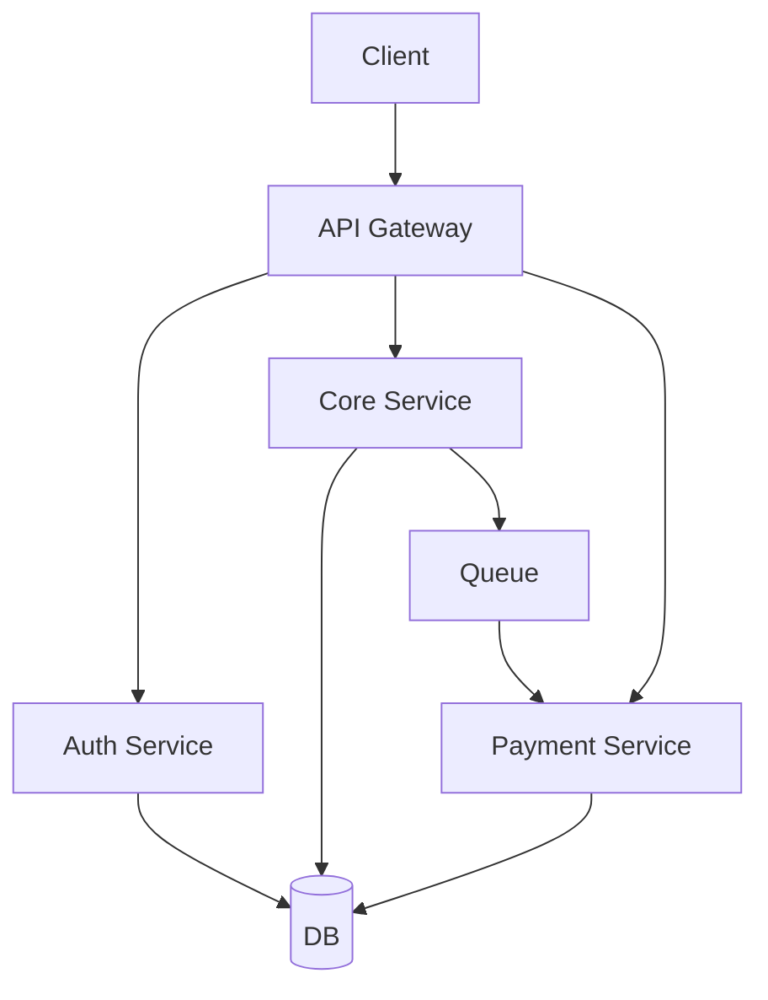
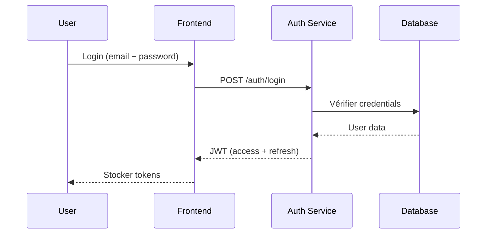
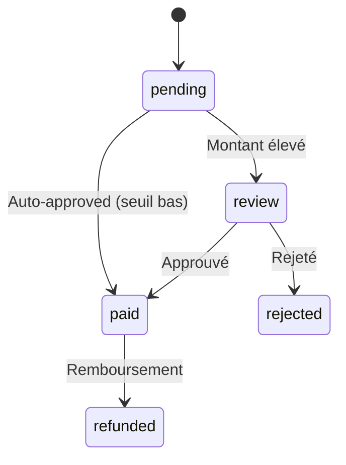
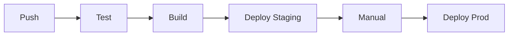
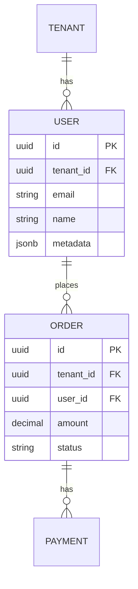

# Architecture Technique — [Nom du projet]

## 1. Stack technique

### Frontend
| Composant | Choix | Justification |
|-----------|-------|---------------|
| Framework | | |
| Langage | | |
| State management | | |
| Design system | | |
| Mobile | | |

### Backend
| Composant | Choix | Justification |
|-----------|-------|---------------|
| Langage | | |
| Framework | | |
| API | | |
| Auth | | |

### Base de données
| Composant | Choix | Justification |
|-----------|-------|---------------|
| Principale | | |
| Cache | | |
| Recherche | | |
| File d'attente | | |

### Infrastructure
| Composant | Choix | Justification |
|-----------|-------|---------------|
| Cloud | | |
| Conteneurs | | |
| CI/CD | | |
| Monitoring | | |

## 2. Architecture applicative

### Pattern
[Monolithe modulaire / Microservices / Serverless]

### Schéma d'architecture



### Communication
- Synchrone : [HTTP/gRPC]
- Asynchrone : [Queue/Events]

## 3. Multi-tenant et isolation

### Stratégie
[Mono-base / Schémas séparés / Bases séparées]

### Résolution du tenant
[JWT / Sous-domaine / Header / Path]

### Modèle de données multi-tenant

```sql
-- Exemple : clé primaire composite
CREATE TABLE orders (
    tenant_id UUID NOT NULL,
    id UUID DEFAULT gen_random_uuid(),
    -- ...
    PRIMARY KEY (tenant_id, id)
);

-- Row-Level Security
ALTER TABLE orders ENABLE ROW LEVEL SECURITY;
CREATE POLICY tenant_isolation ON orders
    USING (tenant_id = current_setting('app.tenant_id')::UUID);
```

### Sécurité inter-tenant
- [ ] RLS PostgreSQL
- [ ] Filtre applicatif
- [ ] Tests de fuite en CI
- [ ] Audit log

## 4. Authentification et autorisation

### Flux d'authentification



### JWT Claims
```json
{
  "sub": "user-id",
  "tenant_id": "tenant-id",
  "realm": "client|staff|admin",
  "roles": ["client"],
  "permissions": ["order:read:self"],
  "scope": "self",
  "aud": "client",
  "exp": 1234567890
}
```

### Middleware d'autorisation
```typescript
// Exemple de guard
function authorize(permission: string) {
  return (req, res, next) => {
    const user = req.user;
    if (!user.permissions.includes(permission)) {
      return res.status(403).json({ error: 'Forbidden' });
    }
    next();
  };
}
```

## 5. Sécurité

### Chiffrement
| Niveau | Mécanisme |
|--------|-----------|
| Transit | TLS 1.3 |
| Repos | AES-256 |
| Base de données | pgcrypto / TDE |

### Gestion des secrets
| Secret | Stockage |
|--------|----------|
| DB credentials | Vault / KMS |
| API keys | Variables d'env |
| JWT secret | Vault |

### Protection
- [ ] Rate limiting (par tenant, par user, global)
- [ ] CSRF protection
- [ ] XSS protection (CSP headers)
- [ ] SQL injection (ORM / parameterized queries)
- [ ] Input validation (zod / joi)
- [ ] Audit logging

## 6. Paiements (si applicable)

### PSP configuré

| PSP | Usage | Fallback |
|-----|-------|----------|
| [Stripe] | Pays A, B | Virement |
| [Paystack] | Afrique | Mobile money |

### Workflow de paiement



### Réconciliation
- [ ] Import de relevés
- [ ] Matching automatique
- [ ] Alertes écarts

## 7. Monitoring et observabilité

| Type | Outil | Métriques |
|------|-------|-----------|
| Logs | | |
| Métriques | | |
| Traces | | |
| Erreurs | | |
| Uptime | | |

## 8. Déploiement

### Environments
| Env | Usage | URL |
|-----|-------|-----|
| Development | Dev local | localhost |
| Staging | Tests | staging.app.com |
| Production | Prod | app.com |

### CI/CD


## 9. Modèle de données

### Entités principales



### Tables détaillées
[Lister les tables avec leurs champs principaux]
