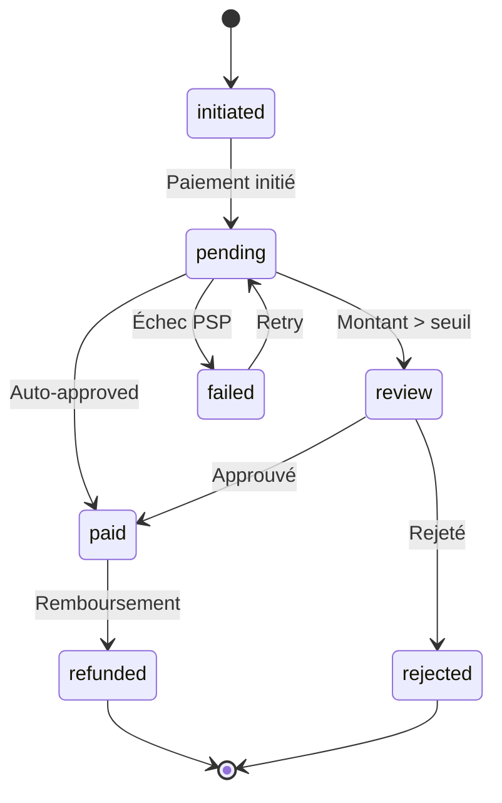
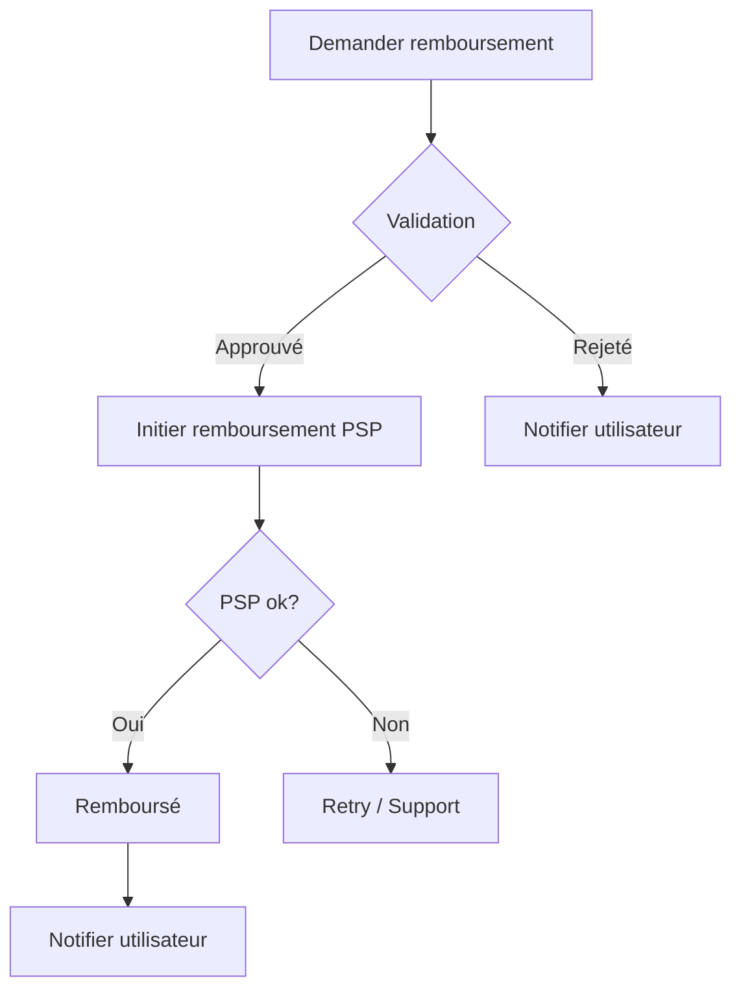

# Paiements — Workflow et fallback

## 1. PSP configuré

### PSP principal
| Champ | Valeur |
|-------|--------|
| **PSP** | [Stripe / PayPal / Paystack / Flutterwave] |
| **Mode** | Test / Production |
| **Clés** | [Stored in Vault] |
| **Webhooks** | `/api/webhooks/stripe` |

### Fallback
| Champ | Valeur |
|-------|--------|
| **Type** | [Virement / Mobile Money / Autre] |
| **Pays couverts** | [Liste des pays] |
| **Instructions** | [Comment l'utilisateur paie] |
| **Validation** | [Manuelle / Automatique] |

### Cartographie PSP par pays

| Pays | PSP principal | Fallback |
|------|---------------|----------|
| France | Stripe | Virement |
| Côte d'Ivoire | Paystack | Mobile Money |
| Sénégal | Paystack | Orange Money |
| Autres | PayPal | Virement |

## 2. Workflow de paiement

### Diagramme d'états



### Règles de transition

| De | Vers | Condition | Action |
|----|------|-----------|--------|
| initiated | pending | PSP répond | Enregistrer transaction |
| pending | paid | Montant < seuil auto | Auto-approuver |
| pending | review | Montant > seuil | File de review |
| pending | failed | Erreur PSP | Notification |
| review | paid | Admin approuve | Confirmer |
| review | rejected | Admin rejette | Refuser |
| paid | refunded | Demande valide | Rembourser |

## 3. Anti-fraude

### Velocity checks

| Règle | Seuil | Action |
|-------|-------|--------|
| Nb transactions / heure | > 5 | Bloquer + alerter |
| Nb transactions / jour | > 20 | Revue manuelle |
| Montant / jour | > 1000€ | Revue manuelle |

### Blacklist

```sql
CREATE TABLE payment_blacklist (
    id UUID PRIMARY KEY,
    type VARCHAR(50) NOT NULL, -- email, ip, card_fingerprint
    value VARCHAR(255) NOT NULL,
    reason TEXT,
    created_at TIMESTAMPTZ DEFAULT NOW()
);
```

### Seuils

| Seuil | Montant | Action |
|-------|---------|--------|
| Bas | < 50€ | Auto-approuver |
| Moyen | 50-500€ | Review optionnelle |
| Haut | > 500€ | Review obligatoire |

## 4. Séparation des devoirs

| Rôle | Peut faire | Ne peut PAS faire |
|------|-----------|-------------------|
| Utilisateur | Initier paiement | Approuver son propre paiement |
| Manager | Review | Approuver les paiements > seuil |
| Admin | Tout | — |

## 5. Réconciliation

### Import de relevés

```typescript
// Format d'import
interface ReconciliationEntry {
  transactionId: string;
  amount: number;
  date: Date;
  status: 'settled' | 'pending';
  fees: number;
}
```

### Matching

```typescript
async function reconcile(entries: ReconciliationEntry[]) {
  for (const entry of entries) {
    const local = await db.payment.findUnique({
      where: { pspTransactionId: entry.transactionId }
    });

    if (!local) {
      await flagUnmatched(entry);
      continue;
    }

    if (local.amount !== entry.amount) {
      await flagAmountMismatch(local, entry);
      continue;
    }

    await markReconciled(local, entry);
  }
}
```

### Alertes

| Alerte | Condition | Action |
|--------|-----------|--------|
| Montantismatch | local ≠ PSP | Alerter admin |
| Transaction orpheline | Pas de match local | Investiguer |
| Écart cumulé | > 1% du volume | Escalader |

## 6. Remboursements

### Workflow



### Règles
- Remboursement total ou partiel
- Délai maximum : 90 jours
- Montant maximum : montant original
- Audit obligatoire

## 7. Monitoring

| Métrique | Seuil alerter | Outil |
|----------|---------------|-------|
| Taux d'échec PSP | > 5% | Grafana |
| Temps moyen paiement | > 10s | Sentry |
| Volume / heure | Anomalie | Datadog |
| Écart réconciliation | > 0.1% | Script custom |
